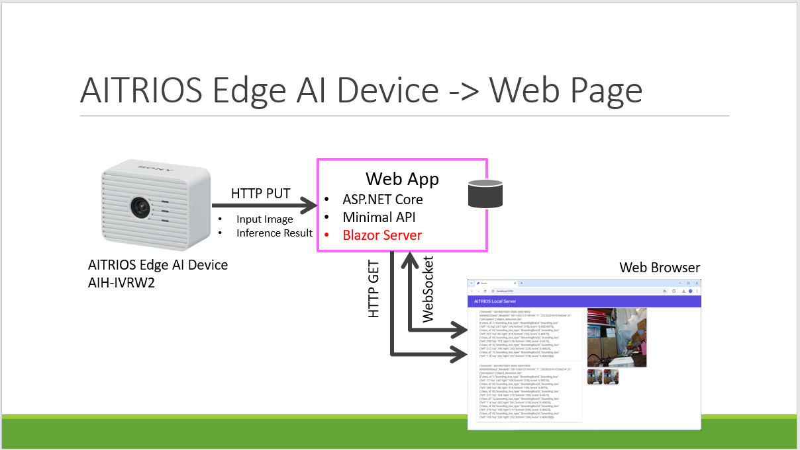

# aitrioslocalserver

ソニーセミコンダクタソリューションズ株式会社が提供しているAITRIOSの外部転送先ローカルサーバーです。

デバイス（AIH-IVRW2）の入力画像と推論結果をWebブラウザで見ることができます。

<a href="media/1.png"></a>

## サーバー起動方法

```bash
cd src
dotnet run
```

## デバイス設定

aitrioslocalserverへ入力画像と推論結果を送信するように、デバイスのCommand Parameter Fileを設定します。

推論結果のみ送信:

```json
"Mode": 2,
"UploadMethodIR": "HTTPStorage",
"StorageNameIR": "http://192.168.1.108:5000",
"StorageSubDirectoryPathIR": "/api/inferencedataupload/meta",
```

入力画像と推論結果を送信:

```json
"Mode": 1,
"UploadMethod": "HTTPStorage",
"StorageName": "http://192.168.1.108:5000",
"StorageSubDirectoryPath": "/api/inferencedataupload/image",
"FileFormat": "JPG",
"UploadMethodIR": "HTTPStorage",
"StorageNameIR": "http://192.168.1.108:5000",
"StorageSubDirectoryPathIR": "/api/inferencedataupload/meta",
```

> [AITRIOS Consoleユーザーマニュアル . A.1.2.StartUploadInferenceData](https://developer.aitrios.sony-semicon.com/edge-ai-sensing/documents/console-user-manual?version=2025-02-03&progLang=#_startuploadinferencedata)

## Appendix

### FlatBuffersのC#コード生成

```bash
$ cd <project root directory>
$ flatc -n --gen-object-api --cs-gen-json-serializer objectdetection.fbs
```

> flatcは[google/flatbuffersのリリース](https://github.com/google/flatbuffers/releases)からダウンロードします。
>
> objectdetection.fbsは[SonySemiconductorSolutions/aitrios-sdk-vision-sensing-app](https://github.com/SonySemiconductorSolutions/aitrios-sdk-vision-sensing-app/tree/main/tutorials/4_prepare_application/1_develop/sdk/schema)からダウンロードします。
